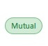
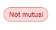

# GitHub Mutual Follow Checker

A lightweight Tampermonkey userscript that adds **Mutual / Not mutual** badges on GitHub “Following” pages.

It compares:
- Users you follow  
  

- Users who follow you  
  

and injects a visual status badge directly into GitHub UI.

## 🚀 Features

- 🔁 Detects mutual followers (Follow back status)
- ⚡ Uses GitHub Public API
- 🎯 Works directly inside GitHub UI
- 🎨 Minimal badge-based UI
- 🧩 No login, tokens, or backend required

## 🧠 How it works

1. Extracts GitHub username from URL  
2. Fetches followers via GitHub API  
   ```
   https://api.github.com/users/{username}/followers
   ```
3. Compares followers vs following list  
4. Injects badge next to each username:
   - Mutual  
   - Not mutual  

## ⚙️ Setup

### 1. Configure Username (Important)

Open the userscript and update this line:

```js
const OWNER = "YOUR-USERNAME";
```

Replace:
```
YOUR-USERNAME → your actual GitHub username
```

## 2. Install Tampermonkey
Chrome Web Store:
https://chromewebstore.google.com/detail/tampermonkey/dhdgffkkebhmkfjojejmpbldmpobfkfo

## 3. Add Script
- Open Tampermonkey → Create new script
- Paste `github-follow-checker.user.js`
- Save

## 4. Open GitHub
Go to:
```
https://github.com/YOUR-USERNAME?tab=following
```

Badges will appear automatically.

## 🔌 Requirements

- Tampermonkey browser extension
- Internet connection (for GitHub API)

## ⚠️ API Limits

GitHub Public API limits:

- 60 requests / hour (unauthenticated)
- Resets every ~1 hour

If limit is reached:
- badges stop updating temporarily

Check limit:
```
https://api.github.com/rate_limit
```

## ⚡ Performance Note

- Fetches API data on page load
- No caching (each refresh triggers API call)
- Future improvement: localStorage caching

## 📌 Notes

- Works only on GitHub “Following” pages
- UI changes in GitHub may break selectors
- Uses public API only (no authentication required)
- No data is stored or sent externally

## 📄 License

MIT License

Made for learning + GitHub profile insights
